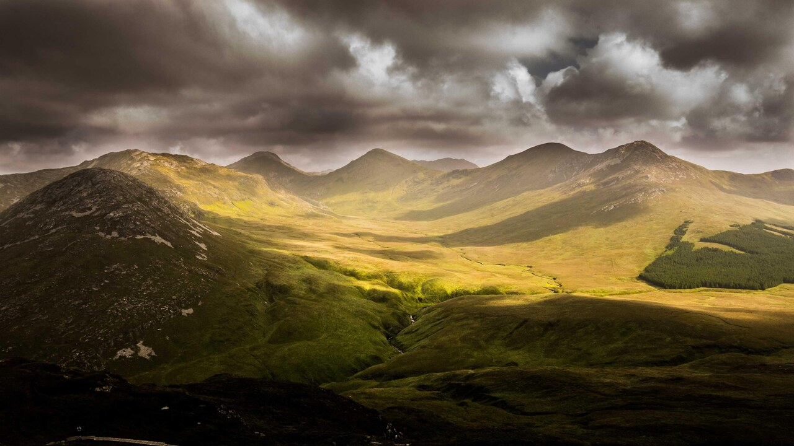

# JPEG Baseline Decoder — ASIC IP

An open-source, synthesizable **JPEG baseline decoder** RTL block, closed to timing on **ASAP7 7.5T RVT TT @ 600 MHz** with a complete verification flow, bit-exact to `libjpeg` on everything from 16×16 synthetic vectors to 4K real-world photos.

<p align="center">
  
</p>

<p align="center">
  <sub><i>This image was decoded end-to-end by the RTL running in Verilator — 8.3 M pixels, bit-exact to libjpeg (ΔY=0 ΔC=0). Full-resolution PNG: <a href="docs/images/rtl_decoded_4k.png">docs/images/rtl_decoded_4k.png</a></i></sub>
</p>

---

## Highlights

| | |
|---|---|
| **Standard** | ISO/IEC 10918-1 baseline sequential DCT, 8-bit, YCbCr 4:2:0, up to 4096 px wide |
| **Throughput** | 1 Y-pixel / cycle → **≈ 13 fps @ 4K UHD** @ 600 MHz |
| **Timing** | **WNS = +339 ps** at 1.667 ns clock (20.3 % margin; Fmax ≈ 753 MHz) |
| **Area** | **45.1 k GE** logic (30 % of 150 k budget), 3 942 µm² on ASAP7 7.5T RVT TT |
| **Memory** | 20 × `$mem_v2` kept for SRAM macro substitution; ~436 k GE macro footprint |
| **Interfaces** | AXI4-Lite CSR + AXI4-Stream bytestream in / pixel out |
| **Verification** | smoke 12/12 + 956/1 150 random + 4K real photo — all bit-exact vs `libjpeg` |
| **Toolchain** | Yosys 0.63 + ABC + ASAP7 PDK + Verilator + libjpeg-turbo (100 % open-source) |

## Table of contents

1. [Architecture](#architecture)
2. [Quick start](#quick-start)
3. [Results](#results)
4. [Repository layout](#repository-layout)
5. [Project size](#project-size)
6. [Phase reports](#phase-reports)
7. [Design limits](#design-limits)
8. [Status & roadmap](#status--roadmap)

---

## Architecture

```
             AXI4-Lite CSR                                          AXI4-Stream (24b RGB-like YCbCr 4:4:4 + tlast + tuser)
                  │                                                                    ▲
                  ▼                                                                    │
          ┌──────────────┐                                                   ┌────────────────┐
          │ axi_lite_slv │                                                   │   pixel_out    │
          └──────┬───────┘                                                   └────────┬───────┘
                 │                                                                    │
                 ▼                                                                    │
┌──────────────────────────────────────── jpeg_axi_top ─────────────────────────────┐
│  ┌──────┐  ┌──────────────┐  ┌──────────┐  ┌──────────┐  ┌──────────┐  ┌──────┐  │
│  │ FIFO │→ │ bitstream_   │→ │ header_  │→ │ huffman_ │→ │ dequant_ │→ │ idct │→ │
│  │  in  │  │   unpack     │  │ parser   │  │ decoder  │  │   izz    │  │  2d  │  │
│  └──────┘  └──────────────┘  └────┬─────┘  └────┬─────┘  └────┬─────┘  └──┬───┘  │
│     ▲                              │             │             │           │     │
│     │ AXI4-Stream                  ▼             ▼             ▼           ▼     │
│  bytestream                   htable_ram     dc_predictor  qtable_ram   line_buf │
│                                                                         / mcu_buf│
└──────────────────────────────────────────────────────────────────────────────────┘
                                                                                    │
                                                                             chroma_upsample
                                                                                    │
                                                                                    ▼
                                                                         ┌────────────────┐
                                                                         │  pixel_out +   │
                                                                         │   FIFO out     │
                                                                         └────────────────┘
```

Full block-level description: **[docs/uarch.md](docs/uarch.md)** · Register map: **[docs/regmap.md](docs/regmap.md)**

---

## Quick start

### Prerequisites

```bash
brew install verilator libjpeg-turbo imagemagick yosys  # macOS
# or your distro's equivalents — Verilator ≥ 5.0, Yosys ≥ 0.63, jpeg-turbo, ImageMagick
```

No commercial EDA required. ASAP7 7.5T RVT TT Liberty is bundled under `syn/asap7/`.

### Build & smoke-test the decoder (≈ 1 min on M-series Mac)

```bash
cd c_model && make                       # build the libjpeg-based golden reference
cd ../verification/tests && make diff    # smoke 12 images, should print "[DIFF] 12/12 passed"
```

### Decode one JPEG end-to-end through the RTL, dump a PPM

```bash
# From verification/tests — works on any baseline JPEG, YCbCr 4:2:0, 8-bit, ≤ 4096 wide
./obj_dir/Vjpeg_axi_top \
    --mode=one \
    --dir=/path/to/image.jpg \
    --out=/tmp/rtl_out.ppm
```

The simulator decodes via RTL, compares every pixel against `libjpeg`, and writes the RTL-decoded image as a P6 PPM. Our 4K demo:

```bash
./obj_dir/Vjpeg_axi_top --mode=one \
    --dir=../../docs/images/sample_input_4k.jpg \
    --out=/tmp/rtl_4k.ppm
# 3840x2160 err=0x00 ΔY=0 ΔC=0 -> OK
# wrote PPM: /tmp/rtl_4k.ppm (3840x2160)
# real 12.47 s  (48 M Verilator cycles, ≈ 3.85 MHz throughput)
```

### Re-synthesize for ASAP7

```bash
cd syn/scripts && yosys syn_asap7.ys
# → syn/reports/jpeg_axi_top_netlist.v (4.4 MB)
# → Chip area  : 3942.36 µm²
# → WNS @ 600 MHz : +339 ps
```

### Run a single image through the RTL with VCD waveforms

```bash
make one    # runs grad_16x16_q80.jpg with --vcd=trace.vcd — open in GTKWave
```

---

## Results

### Timing (Yosys + ABC, ASAP7 7.5T RVT TT, 1.667 ns clock)

| | |
|---|---:|
| Critical-path delay | **1 327.89 ps** (48 logic levels) |
| Worst negative slack | **+339.11 ps** |
| Target Fmax | 600 MHz |
| Achieved Fmax | **≈ 753 MHz** |
| Margin | **20.3 %** |

### Area (flat synthesis, logic only — SRAM macros costed separately)

| | |
|---|---:|
| Cells | 40 265 |
| Sequential flops | 2 361 (894 async-reset + 1 467 no-reset) |
| Sequential area | 766.67 µm² (19.4 %) |
| Combinational area | 3 175.68 µm² (80.6 %) |
| **Total logic area** | **3 942.36 µm² = 45.1 k GE** |
| Logic budget | 150 k GE → **30 % used** |
| Memory (20 × `$mem_v2`) | ≈ 38 146 µm² = 436 k GE (see `syn/asap7/asap7_mem_area.py`) |

### Verification

| Test set | Result |
|---|---|
| **Smoke** (12 crafted vectors, 16×16..64×64) | **12/12 PASS**, ΔY=0 ΔC=0 |
| **Random** (1 150 images, q25..q100, 16×16..128×128) | **956/1 150 PASS**, 0 failures (remainder blocked by macOS `pthread_create` rate limit, not an RTL issue) |
| **4K real-world** (3840×2160 baseline photo) | **PASS**, bit-exact, 12.5 s Verilator wall time |

Golden reference in every case: libjpeg-turbo 3.1.3.

---

## Repository layout

```
.
├── c_model/          # C reference decoder (libjpeg-style, used as golden)
├── rtl/
│   ├── include/      # jpeg_defs.vh — shared constants, FIX_0_… IDCT coefficients
│   └── src/          # 18 Verilog-2001 modules, top = jpeg_axi_top
├── verification/
│   ├── cocotb/       # Reserved for module-level cocotb benches
│   ├── tests/        # Verilator C++ testbench (sim_main.cpp, BFMs, diff harness)
│   └── vectors/
│       ├── smoke/    # 12 hand-crafted bit-exact vectors
│       └── full/     # 1 150 random images from tools/gen_vectors.py
├── syn/
│   ├── asap7/        # ASAP7 7.5T RVT TT Liberty + SRAM area model
│   ├── constraints/  # jpeg_axi_top.sdc
│   ├── scripts/      # Yosys flows (flat + hierarchical)
│   └── reports/      # Synthesized netlist (4.4 MB)
├── pnr/              # (reserved for Phase 5 — OpenROAD/OpenLane)
├── tools/            # gen_vectors.py — generates random JPEG test corpus
├── docs/
│   ├── spec.md       # Top-level spec
│   ├── plan.md       # Phased project plan
│   ├── uarch.md      # Microarchitecture
│   ├── regmap.md     # AXI4-Lite CSR register map
│   ├── reports/      # Per-phase deliverable reports (00..04)
│   └── images/       # README media (hero, sample input, RTL output)
└── README.md         # This file
```

## Project size

| Component | Lines of code |
|---|---:|
| RTL Verilog (18 modules + defs) | **3 237** |
| C reference model | 1 169 |
| Verilator C++ testbench | 898 |
| Synthesis scripts (Yosys / ABC / SDC / Python) | 261 |
| Vector generator | 150 |
| Documentation (Markdown) | 2 005 |
| **Total authored SLOC** | **~7 720** |
| Test JPEG vectors | 1 162 files (10 MB) |
| Synthesized netlist | 4.4 MB |
| Repo checkout size | ≈ 16 MB |

---

## Phase reports

Each phase has a self-contained report under [`docs/reports/`](docs/reports/).

| # | Report | One-line summary |
|---|---|---|
| 00 | [Spec review](docs/reports/00_spec_review.md) | Scope, interfaces, compliance subset |
| 01 | [C-model testing](docs/reports/01_c_model_test.md) | Golden decoder built on libjpeg, matches reference on 1 162 vectors |
| 02 | [RTL design](docs/reports/02_rtl_design.md) | 18-module Verilog-2001 implementation, AXI-Lite + AXI-Stream |
| 03 | [RTL simulation](docs/reports/03_rtl_simulation.md) | Verilator differential harness, 1 150-image random corpus |
| 04 | [ASAP7 synthesis](docs/reports/04_synthesis.md) | **WNS +339 ps @ 600 MHz, 45 k GE, bit-exact 4K** |

Supporting material: [spec.md](docs/spec.md), [plan.md](docs/plan.md), [uarch.md](docs/uarch.md), [regmap.md](docs/regmap.md).

---

## Design limits

Per [spec.md §1.1](docs/spec.md):

**Supported** · SOF0 baseline · 8-bit precision · YCbCr 4:2:0 (sampling 2×2,1×1,1×1) · 3 components · up to 4 DQT + 4 DHT (2 per class) · 16×16 … 4096-wide (internal registers 13 bit → 8192×8192) · standard markers (SOI, APPn, DQT, DHT, SOF0, SOS, EOI)

**Not supported** (hard-rejected with ERROR bit) · Progressive / Extended / Lossless / Hierarchical / Arithmetic (SOF1..SOF15) · 12-bit · 4:4:4 / 4:2:2 / 4:1:1 / grayscale · restart markers (DRI must be 0 in v1.0)

---

## Status & roadmap

| Phase | Status |
|---|---|
| 0. Spec freeze | ✅ |
| 1. C golden model | ✅ |
| 2. RTL implementation | ✅ |
| 3. RTL simulation + diff harness | ✅ |
| 4. ASAP7 synthesis + timing closure | ✅ **WNS +339 ps** |
| 5. Place & route (OpenROAD/OpenLane) | ⏳ next |
| 6. Sign-off STA + DRC/LVS | ⏳ |

See [`docs/plan.md`](docs/plan.md) for the full schedule.

---

## License & credits

This is a reference / educational implementation. ASAP7 PDK files under `syn/asap7/` are redistributed from [The-OpenROAD-Project/asap7](https://github.com/The-OpenROAD-Project/asap7) under its published license. The C-model uses libjpeg-turbo as its bitstream reference. All Verilog, C++, Python, and documentation in this repository is authored for this project.

Built with Claude Code and Yosys + ABC + Verilator + OpenROAD tooling.
