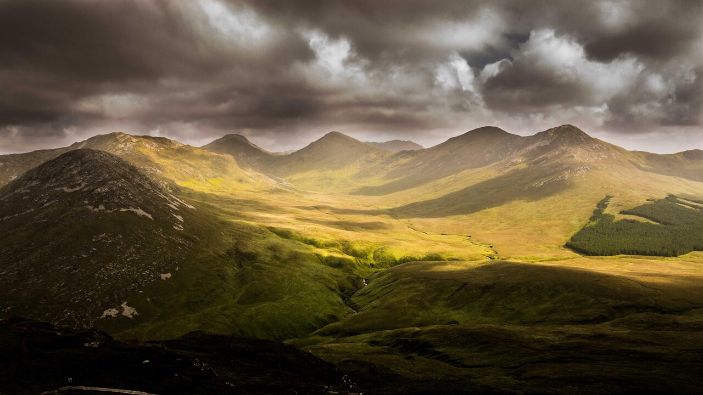

# JPEG Decoder — ASIC IP + full-spec C reference model

An open-source, synthesizable **JPEG baseline decoder** RTL block — closed to timing on **ASAP7 7.5T RVT TT @ 600 MHz** — paired with a **C reference model that now covers most of ISO/IEC 10918-1**: baseline, extended sequential, progressive, lossless, and arithmetic-coded paths, 8/12-bit precision, all common chroma layouts plus CMYK, validated **bit-exact against libjpeg-turbo on a 2 329-vector corpus**.

<p align="center">
  
</p>

<p align="center">
  <sub><i>This image was decoded end-to-end by the RTL running in Verilator — 8.3 M pixels, bit-exact to libjpeg (ΔY=0 ΔC=0). Full-resolution PNG: <a href="docs/images/rtl_decoded_4k.png">docs/images/rtl_decoded_4k.png</a></i></sub>
</p>

---

## Highlights

| | |
|---|---|
| **RTL standard** | ISO/IEC 10918-1 baseline sequential DCT, 8-bit, YCbCr 4:2:0, up to 4096 px wide |
| **C model standard** | SOF0/1/2/3/9/10 (baseline, extended, progressive, lossless, sequential+progressive arithmetic) · P=8 and P=12 DCT, P=2..16 lossless · gray / 4:4:4 / 4:2:0 / 4:2:2 / 4:4:0 / 4:1:1 / CMYK · DRI/restart everywhere |
| **Throughput (RTL)** | 1 Y-pixel / cycle → **≈ 13 fps @ 4K UHD** @ 600 MHz |
| **Timing** | **WNS = +339 ps** at 1.667 ns clock (20.3 % margin; Fmax ≈ 753 MHz) |
| **Area** | **45.1 k GE** logic (30 % of 150 k budget), 3 942 µm² on ASAP7 7.5T RVT TT |
| **Memory** | 20 × `$mem_v2` kept for SRAM macro substitution; ~436 k GE macro footprint |
| **Interfaces** | AXI4-Lite CSR + AXI4-Stream bytestream in / pixel out |
| **Verification** | C model: **2 329/2 329 vectors bit-exact** vs libjpeg-turbo (`make regress`) + 14 corrupted-input reject cases, leak-clean (`make errtest`) · RTL: smoke 12/12 + 956/1 150 random + 4K real photo bit-exact |
| **Toolchain** | Yosys 0.63 + ABC + ASAP7 PDK + Verilator + libjpeg-turbo (100 % open-source) |

## Table of contents

1. [Architecture](#architecture)
2. [Quick start](#quick-start)
3. [Results](#results)
4. [Repository layout](#repository-layout)
5. [Project size](#project-size)
6. [Phase reports](#phase-reports)
7. [Design limits](#design-limits)
8. [Status & roadmap](#status--roadmap)

---

## Architecture

```
             AXI4-Lite CSR                                          AXI4-Stream (24b RGB-like YCbCr 4:4:4 + tlast + tuser)
                  │                                                                    ▲
                  ▼                                                                    │
          ┌──────────────┐                                                   ┌────────────────┐
          │ axi_lite_slv │                                                   │   pixel_out    │
          └──────┬───────┘                                                   └────────┬───────┘
                 │                                                                    │
                 ▼                                                                    │
┌──────────────────────────────────────── jpeg_axi_top ─────────────────────────────┐
│  ┌──────┐  ┌──────────────┐  ┌──────────┐  ┌──────────┐  ┌──────────┐  ┌──────┐  │
│  │ FIFO │→ │ bitstream_   │→ │ header_  │→ │ huffman_ │→ │ dequant_ │→ │ idct │→ │
│  │  in  │  │   unpack     │  │ parser   │  │ decoder  │  │   izz    │  │  2d  │  │
│  └──────┘  └──────────────┘  └────┬─────┘  └────┬─────┘  └────┬─────┘  └──┬───┘  │
│     ▲                              │             │             │           │     │
│     │ AXI4-Stream                  ▼             ▼             ▼           ▼     │
│  bytestream                   htable_ram     dc_predictor  qtable_ram   line_buf │
│                                                                         / mcu_buf│
└──────────────────────────────────────────────────────────────────────────────────┘
                                                                                    │
                                                                             chroma_upsample
                                                                                    │
                                                                                    ▼
                                                                         ┌────────────────┐
                                                                         │  pixel_out +   │
                                                                         │   FIFO out     │
                                                                         └────────────────┘
```

Full block-level description: **[docs/uarch.md](docs/uarch.md)** · Register map: **[docs/regmap.md](docs/regmap.md)**

---

## Quick start

### Prerequisites

```bash
brew install verilator libjpeg-turbo imagemagick yosys  # macOS
# or your distro's equivalents — Verilator ≥ 5.0, Yosys ≥ 0.63, jpeg-turbo, ImageMagick
```

No commercial EDA required. ASAP7 7.5T RVT TT Liberty is bundled under `syn/asap7/`.

### Build & smoke-test the decoder (≈ 1 min on M-series Mac)

```bash
cd c_model && make                       # build the libjpeg-based golden reference
cd ../verification/tests && make diff    # smoke 12 images, should print "[DIFF] 12/12 passed"
```

### C-model full regression

```bash
cd c_model
make test      # unit tests (bitstream, huffman, idct, arith, errors, SOF1 P=12)
make regress   # all 2 329 vectors in verification/vectors/ vs libjpeg-turbo
make errtest   # 14 corrupted vectors must be rejected; leak-checked on macOS
make phase17d  # any single vectors/phase* directory also works as a target
```

### Decode one JPEG end-to-end through the RTL, dump a PPM

```bash
# From verification/tests — works on any baseline JPEG, YCbCr 4:2:0, 8-bit, ≤ 4096 wide
./obj_dir/Vjpeg_axi_top \
    --mode=one \
    --dir=/path/to/image.jpg \
    --out=/tmp/rtl_out.ppm
```

The simulator decodes via RTL, compares every pixel against `libjpeg`, and writes the RTL-decoded image as a P6 PPM. Our 4K demo:

```bash
./obj_dir/Vjpeg_axi_top --mode=one \
    --dir=../../docs/images/sample_input_4k.jpg \
    --out=/tmp/rtl_4k.ppm
# 3840x2160 err=0x00 ΔY=0 ΔC=0 -> OK
# wrote PPM: /tmp/rtl_4k.ppm (3840x2160)
# real 12.47 s  (48 M Verilator cycles, ≈ 3.85 MHz throughput)
```

### Re-synthesize for ASAP7

```bash
cd syn/scripts && yosys syn_asap7.ys
# → syn/reports/jpeg_axi_top_netlist.v (4.4 MB)
# → Chip area  : 3942.36 µm²
# → WNS @ 600 MHz : +339 ps
```

### Run a single image through the RTL with VCD waveforms

```bash
make one    # runs grad_16x16_q80.jpg with --vcd=trace.vcd — open in GTKWave
```

---

## Results

### Timing (Yosys + ABC, ASAP7 7.5T RVT TT, 1.667 ns clock)

| | |
|---|---:|
| Critical-path delay | **1 327.89 ps** (48 logic levels) |
| Worst negative slack | **+339.11 ps** |
| Target Fmax | 600 MHz |
| Achieved Fmax | **≈ 753 MHz** |
| Margin | **20.3 %** |

### Area (flat synthesis, logic only — SRAM macros costed separately)

| | |
|---|---:|
| Cells | 40 265 |
| Sequential flops | 2 361 (894 async-reset + 1 467 no-reset) |
| Sequential area | 766.67 µm² (19.4 %) |
| Combinational area | 3 175.68 µm² (80.6 %) |
| **Total logic area** | **3 942.36 µm² = 45.1 k GE** |
| Logic budget | 150 k GE → **30 % used** |
| Memory (20 × `$mem_v2`) | ≈ 38 146 µm² = 436 k GE (see `syn/asap7/asap7_mem_area.py`) |

### Verification — RTL

| Test set | Result |
|---|---|
| **Smoke** (12 crafted vectors, 16×16..64×64) | **12/12 PASS**, ΔY=0 ΔC=0 |
| **Random** (1 150 images, q25..q100, 16×16..128×128) | **956/1 150 PASS**, 0 failures (remainder blocked by macOS `pthread_create` rate limit, not an RTL issue) |
| **4K real-world** (3840×2160 baseline photo) | **PASS**, bit-exact, 12.5 s Verilator wall time |

### Verification — C model (`make regress`, full corpus)

| Coverage axis | Vectors | Result |
|---|---:|---|
| Baseline + extended seq (SOF0/1), 8-bit, all chroma + CMYK | 1 150 + phase06..13 sets | bit-exact |
| Progressive Huffman (SOF2): DC/AC spectral + refine, DRI, gray/444/420/422/440/411, CMYK | phase16/17/17d/18/prog_dri/12c | bit-exact |
| Sequential + progressive arithmetic (SOF9/SOF10), all chroma + CMYK | phase22/24/24c/12c | bit-exact |
| Lossless (SOF3), P=2..16, predictors 1-7, point transform | phase25/25b/25c/27 (549) | bit-exact |
| 12-bit DCT (SOF0/1/2), gray/444/420/422/440/411 | phase13/13b_prog/13b_ext (76) | bit-exact |
| **Total** | **2 329** | **2 329/2 329, ΔY=0 ΔC=0** |
| Corrupted-input rejection (`make errtest`) | 14 | all rejected, 0 leaks |

Golden reference in every case: libjpeg-turbo 3.1.3.

---

## Repository layout

```
.
├── c_model/          # C reference decoder (libjpeg-style, used as golden)
├── rtl/
│   ├── include/      # jpeg_defs.vh — shared constants, FIX_0_… IDCT coefficients
│   └── src/          # 18 Verilog-2001 modules, top = jpeg_axi_top
├── verification/
│   ├── cocotb/       # Reserved for module-level cocotb benches
│   ├── tests/        # Verilator C++ testbench (sim_main.cpp, BFMs, diff harness)
│   └── vectors/      # 30 directories, 2 351 JPEGs
│       ├── smoke/        # 12 hand-crafted bit-exact vectors
│       ├── full/         # 1 150 random images from tools/gen_vectors.py
│       ├── phase*/       # per-feature sets (progressive, arith, lossless, P=12, CMYK, ...)
│       └── error_cases/  # 14 corrupted inputs the decoder must reject
├── syn/
│   ├── asap7/        # ASAP7 7.5T RVT TT Liberty + SRAM area model
│   ├── constraints/  # jpeg_axi_top.sdc
│   ├── scripts/      # Yosys flows (flat + hierarchical)
│   └── reports/      # Synthesized netlist (4.4 MB)
├── pnr/              # (reserved for Phase 5 — OpenROAD/OpenLane)
├── tools/            # 28 vector generators (gen_vectors.py + per-phase gen_*.py)
├── docs/
│   ├── spec.md       # Top-level spec
│   ├── plan.md       # Phased project plan
│   ├── uarch.md      # Microarchitecture
│   ├── regmap.md     # AXI4-Lite CSR register map
│   ├── reports/      # Per-phase deliverable reports (00..04)
│   └── images/       # README media (hero, sample input, RTL output)
└── README.md         # This file
```

## Project size

| Component | Lines of code |
|---|---:|
| RTL Verilog (18 modules + defs) | ~4 000 |
| C reference model (src + golden harness) | ~6 900 |
| Verilator C++ testbench | ~900 |
| Synthesis scripts (Yosys / ABC / SDC / Python) | ~260 |
| Vector generators (28 scripts) | ~3 000 |
| Test JPEG vectors | 2 351 files (14 MB) |
| Synthesized netlist | 4.4 MB |
| Repo checkout size | ≈ 60 MB |

---

## Phase reports

Each phase has a self-contained report under [`docs/reports/`](docs/reports/).

| # | Report | One-line summary |
|---|---|---|
| 00 | [Spec review](docs/reports/00_spec_review.md) | Scope, interfaces, compliance subset |
| 01 | [C-model testing](docs/reports/01_c_model_test.md) | Golden decoder built on libjpeg, matches reference on 1 162 vectors |
| 02 | [RTL design](docs/reports/02_rtl_design.md) | 18-module Verilog-2001 implementation, AXI-Lite + AXI-Stream |
| 03 | [RTL simulation](docs/reports/03_rtl_simulation.md) | Verilator differential harness, 1 150-image random corpus |
| 04 | [ASAP7 synthesis](docs/reports/04_synthesis.md) | **WNS +339 ps @ 600 MHz, 45 k GE, bit-exact 4K** |

Supporting material: [spec.md](docs/spec.md), [plan.md](docs/plan.md), [uarch.md](docs/uarch.md), [regmap.md](docs/regmap.md).

---

## Design limits

### RTL (per [spec.md §1.1](docs/spec.md), v1.0 scope)

**Supported** · SOF0 baseline · 8-bit precision · YCbCr 4:2:0 (sampling 2×2,1×1,1×1) · 3 components · up to 4 DQT + 4 DHT (2 per class) · 16×16 … 4096-wide (internal registers 13 bit → 8192×8192) · standard markers (SOI, APPn, DQT, DHT, SOF0, SOS, EOI) · plus SOF2 DC-only progressive (Phase 16c)

**Not supported** (hard-rejected with ERROR bit) · full progressive / Extended / Lossless / Hierarchical / Arithmetic · 12-bit · 4:4:4 / 4:2:2 / 4:1:1 / grayscale · restart markers

### C model (current, see [docs/roadmap_v2.md](docs/roadmap_v2.md))

**Supported** · SOF0/SOF1 sequential, SOF2 progressive Huffman (full spectral selection + successive approximation), SOF3 lossless (predictors 1-7, point transform, P=2..16), SOF9 sequential arith, SOF10 progressive arith · P=8 and P=12 for all DCT paths (SOF9/10 P=12 pending) · gray / 4:4:4 / 4:2:0 / 4:2:2 / 4:4:0 / 4:1:1 / CMYK (Nf=4) · DRI/restart in every path

**Not yet** · SOF5/6/7 DCT hierarchical · SOF13/14/15 arith hierarchical · SOF11 lossless arith (blocked by libjpeg-turbo reference; needs libjpeg-9) · P=12 in SOF9/SOF10 · CMYK + P=12

---

## Status & roadmap

### v1.0 baseline ASIC flow

| Phase | Status |
|---|---|
| 0. Spec freeze | ✅ |
| 1. C golden model | ✅ |
| 2. RTL implementation | ✅ |
| 3. RTL simulation + diff harness | ✅ |
| 4. ASAP7 synthesis + timing closure | ✅ **WNS +339 ps** |
| 5. Place & route (OpenROAD/OpenLane) | ⏳ |
| 6. Sign-off STA + DRC/LVS | ⏳ |

### v2 full-spec expansion ([docs/roadmap_v2.md](docs/roadmap_v2.md))

| Wave | C model | RTL |
|---|---|---|
| 2 — SOF1 + 12-bit | ✅ (incl. SOF2 P=12 via 13b-prog/-ext) | ⏳ 16-bit datapath + 48b tdata |
| 3 — Progressive (SOF2) | ✅ all chroma + CMYK + DRI | ✅ DC-only (16c); AC/refine ⏳ |
| 4 — Arithmetic (SOF9/10) | ✅ all chroma + CMYK | ⏳ |
| 5 — Lossless (SOF3) | ✅ P=2..16 (SOF11 blocked upstream) | ⏳ |

The C model leads; RTL phases 17b/18b/19/20/23c/24b pick up each wave's
scan machinery against the already-validated vector corpus.

See [`docs/plan.md`](docs/plan.md) for the v1.0 schedule and
[`docs/roadmap_v2.md`](docs/roadmap_v2.md) for the expansion plan.

---

## License & credits

This is a reference / educational implementation. ASAP7 PDK files under `syn/asap7/` are redistributed from [The-OpenROAD-Project/asap7](https://github.com/The-OpenROAD-Project/asap7) under its published license. The C-model uses libjpeg-turbo as its bitstream reference. All Verilog, C++, Python, and documentation in this repository is authored for this project.

Built with Claude Code and Yosys + ABC + Verilator + OpenROAD tooling.
